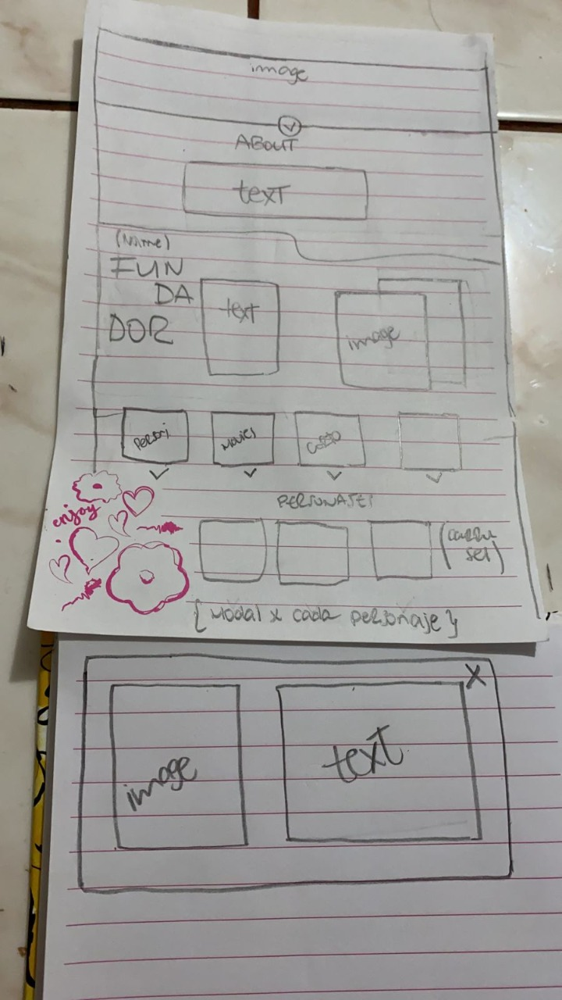
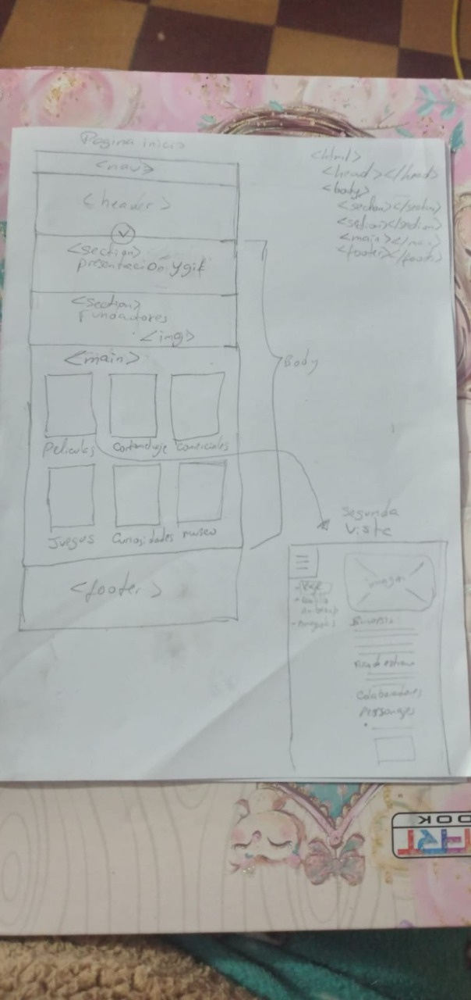

# Data Lovers
## INDICE
* [1. Preámbulo](#studio-ghibli-world)
* [2. Resumen del proyecto](#resumen-del-proyecto)
* [3. Objetivos de aprendizaje](#objetivos-de-aprendizaje-🔧)
* [4. Planning](#planning-sprints-📋)
* [5. Criterios de aceptación mínimos del proyecto](#5-criterios-de-aceptación-mínimos-del-proyecto)
* [6. Hacker edition](#6-hacker-edition)
* [7. Consideraciones técnicas](#7-consideraciones-técnicas)
* [8. Pistas, tips y lecturas complementarias](#8-pistas-tips-y-lecturas-complementarias)
* [9. Checklist](#9-checklist)
*
## STUDIO GHIBLI WORLD 🎬 🍿
Inspirado en el mundo del *Studio Ghibli*, hemos desarrollado una página donde el usuario pueda encontrar las 20 peliculas mas aclamadas incluyendo información detallada sobre personajes, locaciones, vehiculos y caracteristicas, ademas de proporcionar herramientas para que los usuarios puedan tener acceso a las paginas oficiales y plataformas de streaming.

### Resumen del proyecto 📝
Este proyecto esta basado en la manipulación de data proporcionada por el equipo de [Laboratoria](https://github.com/Laboratoria/LIM015-data-lovers), cuyo challenge es visualizar, filtrar, ordenar y mostrar un calculo agregado del rating score de las peliculas.

### Objetivos de aprendizaje 🔧
_UX_
- [x] UX (Diseñar la aplicación pensando y entendiendo al usuario.)
- [x] UX [Crear prototipos para obtener feedback e iterar.]
- [x] UX [Aplicar los principios de diseño visual (contraste, alineación, jerarquía).]
- [x] UX [Planear y ejecutar tests de usabilidad.]

_HTML/CSS_
- [x] HTML, CSS [Uso de HTML semántico.]
- [x] HTML, CSS [Uso de selectores de CSS.]
- [x] HTML, CSS [Construir tu aplicación respetando el diseño realizado (maquetación).]
- [x] HTML, CSS [Uso de flexbox en CSS.]

_DOM_
- [x] DOM [Uso de selectores del DOM.]
- [x] DOM [Manejo de eventos del DOM.]
- [x] DOM [Manipulación dinámica del DOM (appendChild |createElement | createTextNode| innerHTML | textContent | etc.).]

_JAVASCRIPT_
- [x] Javascript [Uso de condicionales (if-else | switch | operador ternario).]
- [x] Javascript [Uso de bucles (for | for..in | for..of | while).]
- [x] Javascript [Uso de funciones (parámetros | argumentos | valor de retorno).]
- [x] Javascript [Declaración correcta de variables (const & let).]
- [x] Javascript [Manipular arrays (filter | map | sort | reduce).]
- [ ] Javascript [Manipular objects (key | value).]
- [x] Javascript [Uso de ES Modules (import | export).]
- [x] Javascript [Diferenciar entre expression y statements.]
- [x] Javascript [Diferenciar entre tipos de datos atómicos y estructurados.]

_TESTING_
- [x] Testing [Testeo unitario.]

_ESTRUCTURA DEL CODIGO, GUIA DE ESTILO_
- [x] Estrutura do código [Organizar y dividir el código en módulos (Modularización).]
- [x] Guia de estilo [Uso de identificadores descriptivos (Nomenclatura | Semántica).]
- [x] Guia de estilo [Uso de linter (ESLINT).]

_GIT, GITHUB_
- [x] Git, GitHub [Uso de comandos de git (add | commit | pull | status | push).]
- [x] Git, GitHub [Manejo de repositorios de GitHub (clone | fork | gh-pages).]
- [x] GitHub [Colaboración en Github (branches | pull requests | |tags).]

## Planning sprints 📋
Durante 5 sprints tratamos de priorizar ciertas historias de usuario
- Recolectamos historias de usuario a través de form y estructuramos la maquetación principal
- Realizar funciones principales de filtrado para manipulación de data
- Renderizar las funciones creadas e implementamos un buscador
- Complementación de CSS(incluyendo el responsive)
- Aplicación de testing unitario

### Prototipos 🚀
* _Imagenes iniciales:_  

| PROTOTIPO DE BAJA FIDELIDAD | PROTOTIPO DE BAJA FIDELIDAD |
| ------------ | ------------- |
|  | |

| PROTOTIPO DE ALTA FIDELIDAD | 
| ------------ |
|  |

* _Producto final:_  
[gh-pages](https://alissonsegura.github.io/LIM015-data-lovers/src/)

### Links relacionados
* [Forms](https://forms.gle/vbyYfxgUTVfBxMZn6)
* [Trello](https://trello.com/b/Z0Mzkksm/data-lovers-studio-ghibli)
* [Figma](https://www.figma.com/file/v5dOaLnlzRwEKellJogx78/DATA-LOVERS-STUDIO-GHIIBLI?node-id=0%3A1)

## Autores ✒️
Las bases de este proyecto son gracias a:
* *Alisson Segura* - Trabajo colaborativo - [alissonsegura](https://github.com/alissonsegura)
* *Andrea Blanco* - Trabajo colaborativo - [Andu15](https://github.com/Andu15)