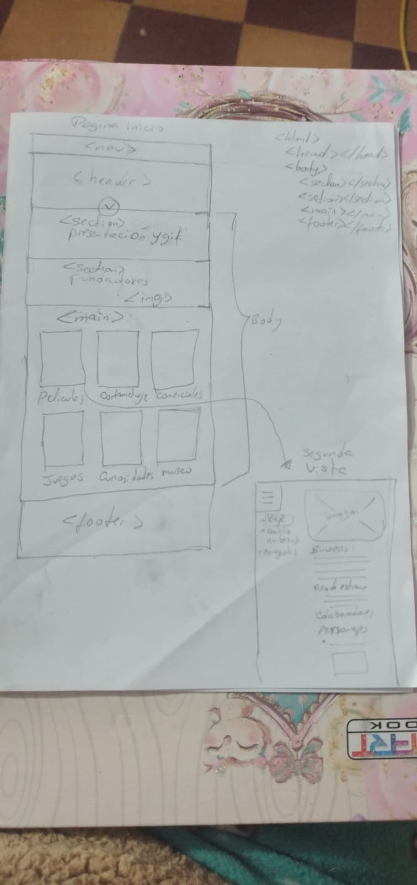
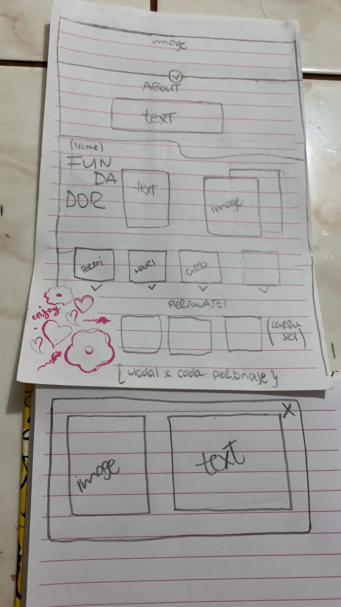

# Data Lovers
## INDICE
* [1. Preámbulo](#studio-ghibli-world)
* [2. Resumen del proyecto](#resumen-del-proyecto)
* [3. Objetivos de aprendizaje](#objetivos-de-aprendizaje-🔧)
* [4. Planning](#planning-sprints-📋)
* [5. Criterios de aceptación mínimos del proyecto](#5-criterios-de-aceptación-mínimos-del-proyecto)
* [6. Hacker edition](#6-hacker-edition)
* [7. Consideraciones técnicas](#7-consideraciones-técnicas)
* [8. Pistas, tips y lecturas complementarias](#8-pistas-tips-y-lecturas-complementarias)
* [9. Checklist](#9-checklist)
***
## STUDIO GHIBLI WORLD 🎬🍿
Inspirado en el mundo del **Studio Ghibli**, hemos desarrollado una página donde el usuario pueda encontrar las 20 peliculas mas aclamadas incluyendo información detallada sobre personajes, locaciones, vehiculos y caracteristicas, ademas de proporcionar herramientas para que los usuarios puedan tener acceso a las paginas oficiales y plataformas de streaming.

### Resumen del proyecto 🗂️
Este proyecto esta basado en la manipulación de data proporcionada por el equipo de [Laboratoria](https://github.com/Laboratoria/LIM015-data-lovers), cuyo challenge es visualizar, filtrar, ordenar y mostrar un calculo agregado del rating score de las peliculas.

### Objetivos de aprendizaje 🔧
__UX__
- [x] Diseñar la aplicación pensando y entendiendo al usuario.
- [x] Crear prototipos para obtener feedback e iterar.
- [x] Aplicar los principios de diseño visual (contraste, alineación, jerarquía).
- [x] Planear y ejecutar tests de usabilidad.

__HTML/CSS__
- [x] Uso de HTML semántico.
- [x] Uso de selectores de CSS.
- [x] Construir tu aplicación respetando el diseño realizado (maquetación).
- [x] Uso de flexbox en CSS.

__DOM__
- [x] Uso de selectores del DOM.
- [x] Manejo de eventos del DOM.
- [x] Manipulación dinámica del DOM (appendChild, createElement, createTextNode, innerHTML,  textContent, etc.).

__JAVASCRIPT__
- [x] Uso de condicionales (if-else, switch, operador ternario).
- [x] Uso de bucles (for, for..in, for..of, while).
- [x] Uso de funciones (parámetros, argumentos, valor de retorno).
- [x] Declaración correcta de variables (const & let).
- [x] Manipular arrays (filter, map, sort, reduce).
- [ ] Manipular objects (key, value).
- [x] Uso de ES Modules (import, export).
- [x] Diferenciar entre expression y statements.
- [x] Diferenciar entre tipos de datos atómicos y estructurados.

__TESTING__
- [x]Testeo unitario.

__ESTRCTURA DEL CODIGO, GUIA DE ESTILO__
- [x] Organizar y dividir el código en módulos (Modularización).
- [x] Uso de identificadores descriptivos (Nomenclatura, Semántica).
- [x] Uso de linter (ESLINT).

__GIT, GITHUB__
- [x] Uso de comandos de git (add, commit, pull, status, push).
- [x] Manejo de repositorios de GitHub (clone, fork, gh-pages).
- [x] Colaboración en Github (branches, pull requests, tags).

## Planning sprints 📋
_Durante 5 sprints tratamos de priorizar ciertas historias de usuario_
- Recolectamos historias de usuario a través de form y estructuramos la maquetación principal
- Realizar funciones principales de filtrado para manipulación de data
- Renderizar las funciones creadas e implementamos un buscador
- Complementación de CSS(incluyendo el responsive)
- Aplicación de testing unitario

### Imagenes 🚀
* __*Imagenes iniciales:*__  

| PROTOTIPO DE BAJA FIDELIDAD | PROTOTIPO DE BAJA FIDELIDAD |
| ------------ | ------------- |
|  | |

| PROTOTIPO DE ALTA FIDELIDAD | 
| ------------ |
|  |

* __*Producto final:*__  
[gh-pages](https://alissonsegura.github.io/LIM015-data-lovers/src/)

### Links relacionados
* [Forms](https://forms.gle/vbyYfxgUTVfBxMZn6)
* [Trello](https://trello.com/b/Z0Mzkksm/data-lovers-studio-ghibli)
* [Figma](https://www.figma.com/file/v5dOaLnlzRwEKellJogx78/DATA-LOVERS-STUDIO-GHIIBLI?node-id=0%3A1)

## Autores ✒️
_Las bases de este proyecto son gracias a:_
* **Alisson Segura** - *Trabajo colaborativo* - [alissonsegura](https://github.com/alissonsegura)
* **Andrea Blanco** - *Trabajo colaborativo* - [Andu15](https://github.com/Andu15)